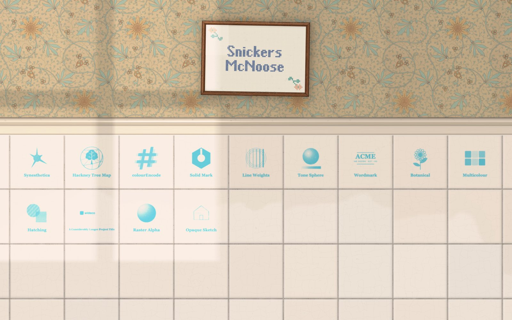

# mcnoose.com

My portfolio site. It's a bathroom wall: old wallpaper with a framed cross-stitch sampler, a painted dado rail, white tiles with a project printed on each, and a skirting board at the bottom.

<a href="https://mcnoose.com" target="_blank" rel="noopener noreferrer">It's here.</a> Desktop is best, but it works on phones too.



## Intent

I wanted a scene that felt alive, not a picture of one. A real wall is lit by something, so its light changes, it has aged, and it responds when you touch it. Most of the work went into making those things true of this one, so that each part of it looks like it belongs in the same room.

## How it works

### Simulating the room

There is one room, defined in centimetres (`src/room.ts`): a window on the wall behind you, a ceiling light, and light bouncing up off the floor. Every surface works out its own shading from its own position on the wall, so the wallpaper, the frame, each tile, and each length of rail and skirting are lit slightly differently from their neighbours. Nothing has highlights or shadows painted on.

The light moves. Clouds pass the window at random, which you mostly see in the reflections. The sun throws the window's panes onto the wall as a soft patch. Over the first few minutes of a visit the sun sets: the light warms, the patch climbs the wall, and the room settles at dusk.

Reflections come from the same window. The sampler's glass reflects it by mirror geometry, and it slides with parallax as you scroll. Each tile traces the room through its own slight tilt and waviness, so no two reflect quite the same thing.

It has also aged. The wallpaper has yellowed, with a clean patch behind the frame and grime around it, and seams that have lifted and torn a little. The tiles are crazed, with dried water marks and limescale. The grout is discoloured and in places mouldy. Dust sits on the rail and skirting, and the skirting is scuffed where shoes have hit it.

### Controls

Every value that shapes the scene is a constant in `src/config.ts`, about 200 of them. In development, a panel (lil-gui) gives each one a slider. I tuned the scene by eye with that panel, and saving writes the values back into the source. Most of the design happened this way.

### Generating the site

`npm run build` produces a single `index.html` with everything inlined, beside `projects.json` and `logos/`. The wallpaper is expensive to render, so it's baked at build time: the scanned pattern is recoloured ink by ink, embossed, and lit with the configured values.

### Keeping the simulation in the page

Only the wallpaper is baked. The room itself still runs in the browser, so lighting, clouds, the sunset and reflections are computed live on canvas.

The wall isn't responsive. It's anchored once, and resizing the window shows more or less of it rather than rearranging it. On desktop it's also pinned to your physical screen: move the browser window and you're looking at a different part of the same wall, and the reflections shift as they would. Projects only go on tiles that are fully in view, so they re-flow, with a crossfade, when the visible tiles change.

### Interactions

They're meant to be found rather than announced.

- Drag across the rail or skirting with the mouse to wipe the dust off. Limescale on the tiles takes a few passes.
- Click the sampler to turn it over. The note on the back is in my handwriting.
- Drag the sampler and it turns on its nail, then swings back and settles like a pendulum. Its reflection stays put while the frame moves. Swing it too far and it falls off the wall.
- Hover a tile to see the project's logo in its own colours instead of printed.

### Printed projects

Each logo is printed onto its tile as a halftone. The dots come from <a href="https://github.com/nicc/halftone-print" target="_blank" rel="noopener noreferrer">halftone-print</a>, a small package I wrote for this. Darker, more opaque parts of a logo print more ink.

## Stack

TypeScript and Canvas 2D, with no framework, built by Vite. Tests are Vitest for units and Playwright for end-to-end runs in Chromium, Firefox and WebKit, plus phone emulation. Screenshots (`npm run shots`) were how I checked visual changes.

## Development

```sh
npm install
npm run dev        # with the tweak panel
npm test
npm run test:e2e
npm run shots      # screenshots of the wall and each tile, in shots/
npm run build
```

`?fixtures` in dev swaps in a set of test logos (fine lines, tone, small text, colour, moiré).

## Adding a project

Edit `projects.json` (next to `index.html` on the server; `public/projects.json` in the repo) and drop the logo into `logos/` beside it. No rebuild needed.

```json
{ "title": "My Project", "url": "https://example.com", "logo": "my-project.svg" }
```

Logos are SVG or PNG on the same site.

## The about note

The note on the back of the sampler is real handwriting, cut from a photo. Put the photo at `note-src/note-photo.png` (kept out of git), set which lines to keep in `tools/prepare-note.py`, and run `python3 tools/prepare-note.py` (numpy, scipy, Pillow). It writes ink-only line images and their layout to `src/about/`.

## Deployment

Upload the contents of `dist/` (`index.html`, `projects.json`, `logos/`) to any static host. It has to be served over http(s). Opening `index.html` from disk won't load the projects.

## Acknowledgements / built with

- <a href="https://claude.com/claude-code" target="_blank" rel="noopener noreferrer">Claude Code</a> wrote the code.
- The wallpaper is a scan of a sidewall from about 1875 in the <a href="https://www.si.edu/object/sidewall:chndm_1939-45-7-a_b" target="_blank" rel="noopener noreferrer">Cooper Hewitt, Smithsonian Design Museum</a> collection (1939-45-7), released under CC0.
- <a href="https://github.com/nicc/halftone-print" target="_blank" rel="noopener noreferrer">halftone-print</a> prints the halftones.
- <a href="https://vite.dev" target="_blank" rel="noopener noreferrer">Vite</a> and <a href="https://github.com/richardtallent/vite-plugin-singlefile" target="_blank" rel="noopener noreferrer">vite-plugin-singlefile</a> do the build.
- <a href="https://lil-gui.georgealways.com" target="_blank" rel="noopener noreferrer">lil-gui</a> is the tweak panel.
- <a href="https://sharp.pixelplumbing.com" target="_blank" rel="noopener noreferrer">sharp</a> prepares and bakes the wallpaper.
- <a href="https://playwright.dev" target="_blank" rel="noopener noreferrer">Playwright</a> and <a href="https://vitest.dev" target="_blank" rel="noopener noreferrer">Vitest</a> run the tests.
